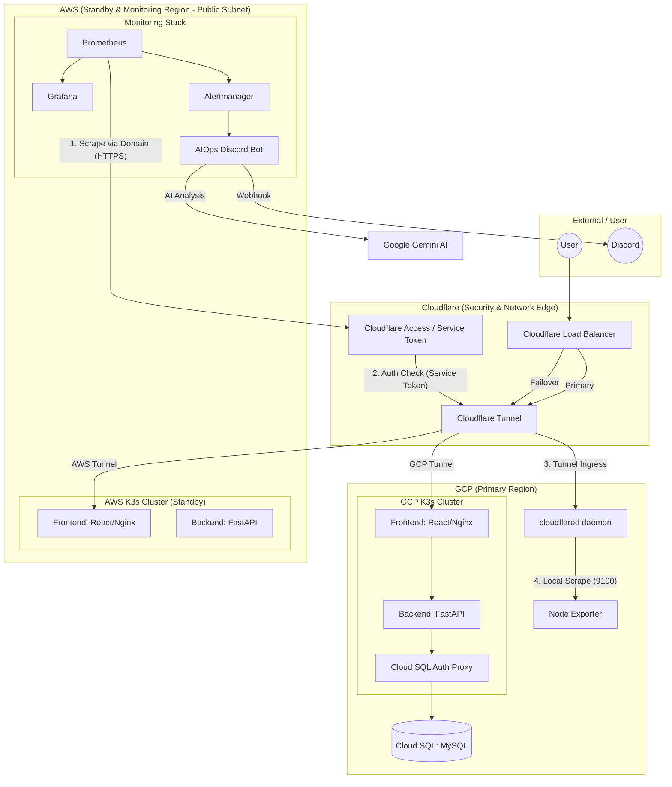

# Chilseongpa Project Architecture (Cloudflare Tunnel Version)

이 문서는 **Cloudflare Tunnel**과 **AWS 퍼블릭 서브넷** 구성을 기반으로 한 고가용성 멀티 클라우드 아키텍처를 설명합니다.

## 1. 전체 시스템 아키텍처 (Modern Multi-Cloud)

---

## 2. 구성 요소 및 통신 방식

### 2.1 AWS 인스턴스 구성
- **퍼블릭 서브넷 배치**: 모든 AWS 인스턴스(Monitoring, K3s Standby)는 퍼블릭 서브넷에 배치되어 인터넷 게이트웨이(IGW)를 통해 직접 외부와 통신합니다.
- **NAT Gateway 불필요**: 인스턴스가 직접 아웃바운드 통신이 가능하므로 비용이 발생하는 NAT Gateway가 필요하지 않습니다.
- **보안**: 퍼블릭 IP를 가지지만, **Security Group** 및 **Cloudflare Access**를 통해 허가되지 않은 접근을 차단합니다.

### 2.2 메트릭 수집 (Cloudflare Tunnel + Access)
본 구조는 SSH 터널링 대신 Cloudflare의 Zero Trust 망을 활용합니다.

1.  **GCP 측**: `cloudflared` 데몬이 Node Exporter(9100) 포트를 Cloudflare 에지로 터널링합니다.
2.  **보안 설정**: Cloudflare Access를 사용하여 `gcp-metrics.example.com` 도메인에 **Service Token** 인증을 걸어둡니다.
3.  **AWS Prometheus 측**: 
    - Prometheus가 `https://gcp-metrics.example.com`으로 요청을 보냅니다.
    - 요청 헤더에 `CF-Access-Client-Id` 및 `CF-Access-Client-Secret`을 포함하여 인증을 통과합니다.
    - 인터넷을 통해 안전하게 암호화된 상태로 GCP 메트릭을 수집합니다.

---

## 3. 이 아키텍처의 장점

- **운영 편의성**: Bastion을 통한 복잡한 SSH 포트 포워딩 스크립트나 터널 유지가 필요 없습니다.
- **확장성**: GCP 노드가 추가되어도 Cloudflare 대시보드 또는 테라폼 설정만으로 수집 대상을 쉽게 확장할 수 있습니다.
- **고급 보안**: SSH 포트를 외부에 열어둘 필요가 없으며, Cloudflare의 강력한 인증(Service Token)을 통해 메트릭 데이터를 보호합니다.
- **비용 최적화**: NAT Gateway 없이 퍼블릭 서브넷을 활용하면서도 보안성은 Zero Trust 모델로 유지합니다.

---

## 4. 장애 대응 (DR)
- **자동 페일오버**: Cloudflare LB가 GCP 타겟 장애를 감지하면 즉시 AWS 퍼블릭 서브넷에 있는 Standby 클러스터로 트래픽을 넘깁니다.
- **AIOps 알림**: 장애 발생 시 Prometheus 가 수집한 데이터를 바탕으로 `bot.py`가 즉각적인 분석 및 보고를 수행합니다.
